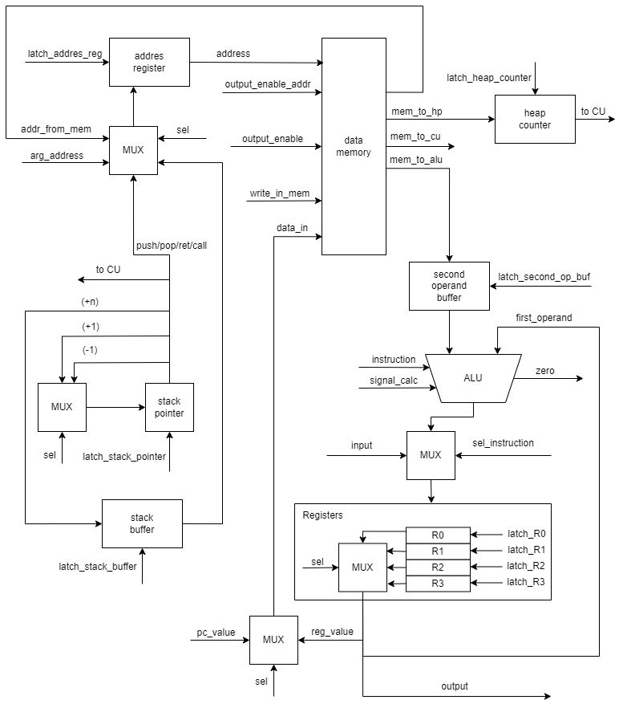

- Стрельбицкий Илья Павлович, P33101
- `lisp | cisc | harv | hw | instr | binary | stream | mem | cstr | prob1 | [4]char`
- Вариант с усложнением
## AbobaLisp - Язык программирования
### Синтаксис
#### Формальное описание
```
<program> ::= {(<expression>)}
<expression> ::= <can_nested_exp> | <cannot_nested_exp>
<can_nested_exp> ::= 
              <print_number_exp> |
              <print_exp> |
              "(" "read" " " <name_var> " " <number> ")" |
              "(" <binary_operand> " " <can_nested> " " <can_nested> ")" |
              "(" <ternary_operand> " " <can_nested> " " <can_nested> " " <can_nested> ")" |
              "(" "set" " " <name_var> " " <can_nested> ")"
              "(" "call" " " <name_function> " " <args> ")"
              "(" "iter" " " <name_var> " " <number> " " <can_nested_exp> ")"
<cannot_nested_exp> ::= <function_declaration> | <var_declaration>
<can_nested> ::= <atomic> | <can_nested_exp>
<atomic> ::= <number> | <string> | <name_var>
<binary_operand> ::= "+" | "-" | "*" | "/"
<ternary_operand> ::= "if"
<print_number_exp> ::= "(" "print_number" " " <number> ")" | "(" "print_number" " " <name_var> " " <number> ")"
<print_exp> ::= "(" "print" " " <string> ")" | "(" "print" " " <name_var> " " <number> ")"
<function_declaration> ::= "(" "aboba" " " <name_function> " " <params> " " <can_nested_exp> ")"
<var_declaration> ::= "(" "var" " " <name_var> " " <atomic> ")"
<keyword> ::= "print_number" | "print" | "read" | "+" | "-" | "*" | "/" | "if" | "aboba" | "var" | "set" | "call" | "iter"
<params> ::= "(" {<name_var>} ")"
<args> ::= "(" {<atomic>} ")"
<name_var> ::= "[a-zA-Z_]+"
<name_function> ::= "[a-zA-Z_]+"
<number> ::= "-?\d+"
<string> ::= "".*""
```
#### var - объявление переменной
- 1 аргумент - название переменной.
- 2 аргумент - выражение, инициализирующее переменную.
- Пример объявления переменной: `(var first 0)`
- Выражение не может быть вложенным, поэтому ничего не возвращает.
#### set - присвоение значения переменной
- 1 аргумент - название переменной.
- 2 аргумент - выражение, значение которого присваивается переменной, нельзя присвоить строковое значение.
- Пример присвоения значения переменной: `(set first 3)`
- Выражение возвращает значение переменной.
#### if - условный оператор
- 1 аргумент - выражение-условие.
- 2 аргумент - выражение, которое выполняется, если результат выражения условия равен нулю.
- 3 аргумент - выражение, которое выполняется, если результат выражения условия не равен нулю, либо строка.
- Пример условного оператора: `(if (- a (* 2 (/ a 2))) (print ("a is even")) (print ("a is odd")))`
- Возвращает значение аргумента 2, если результат выражения равен нулю. Возвращает значение аргумента 3, если не равен нулю.
#### iter - оператор цикла
- 1 аргумент - название переменной-итератора, переменная должна быть проинициализирована до этого.
- 2 аргумент - максимальное значение переменной-итератора. Когда значение переменной-итератора становится равным этому числу цикл завершается.
- 3 аргумент - основное выражение - тело цикла, после выполнения тела цикла значение переменной-итератора увеличивается на 1.
- Пример цикла: `(iter i 50 (print i 10))`
- Выражение возвращает последнее значение тела цикла.
#### aboba - определение функции
- 1 аргумент - название функции.
- 2 аргумент - аргументы функции в формате (имя_переменной_1 имя_переменной_2 ... имя_переменной_n).
- 3 аргумент - тело функции (выражение).
- Пример определения функции: `(aboba sum (a b) (+ a b))`
- Выражение не может быть вложенным, поэтому ничего не возвращает.
#### call - вызов функции
- 1 аргумент - название функции.
- 2 аргумент - аргументы функции в формате (аргумент_функции_1 аргумент_функции_2 ... аргумент_функции_n).
- Пример вызова функции: `(call sum (2 8))`
- Выражение возвращает результат работы функции.
#### Математические операторы
- `(+ a 5)` - сложение.
- `(- b 10)` - вычитание.
- `(* 4 5)` - умножение.
- `(/ a b)` - целочисленное деление.
#### Ввод/вывод
- `(print_number 1)` - печать числа (всегда возвращает 0)
- `(print "string for printing")` - печать строки (всегда возвращает 0).
- `(read name_var 20)` - чтение строки в переменную, 2-й аргумент число, 
которое равно значению количества байт выделяемых в куче, 
для того чтобы поместить считываемую строку в кучу (всегда возвращает 0).
#### Переменные
Все переменные объявляются при помощи ключевого слова var.<br>
Типизация динамическая.<br>
Область видимости всех переменных и функций глобальная.<br>
Переменные и функции нельзя назвать именами объявленных ранее переменных или функций.<br>
Выражения объявления переменных и функций не могут быть вложенными.
### Семантика
#### Стратегия вычисления
Аппликативный порядок вычислений, то есть вычисления выполняются слева направо и изнутри наружу.
- Объявления переменных должны быть расположены последовательно в начале программы.
- Объявления функций должны быть расположены последовательно после объявления переменных.
- Все числа положительные.
- Каждое выражение выполняется только после выполнения внутренних элементов.
- Передача аргументов в вызванную функцию только по значению для чисел и указателю для строк.
- Если в качестве аргумента передана строка, то аргументом является указатель на начало этой строки.

## Организация памяти
Память разделена на память инструкций и память данных.
### Память инструкций

1. В памяти 4096 ячеек, адрес ячейки составляет 12 бит.
2. Размер слова составляет 2 байта (16 бит).
3. Последовательное размещение машинных слов, без выравнивания.
### Память данных

1. В памяти 4096 ячеек, адрес ячейки составляет 12 бит.
2. Размер машинного слова составляет 4 байта (32 бит).
3. Именованная память - хранит переменные в глобальной области видимости (числа и указатели на строки).
4. 1-я ячейка в памяти - порт ввода, запись не дает никакого эффекта.
5. 2-я ячейка в памяти - порт вывода, чтение всегда возвращает ноль.
6. 3-я ячейка в памяти - хранит начальное значение для Heap Counter.
7. Куча - хранит в себе тела строк и числовые константы.
8. Стек - хранит результаты выражений, аргументы переданные в функции и адреса возврата для функций.
9. Последовательное размещение машинных слов, без выравнивания.
### Регистры
1. Есть 4 регистра общего назначения (R0, R1, R2, R3), размер каждого по 4 байта (32 бит).
2. Program Counter (PC) - счетчик команд, размер 12 бит - значение по умолчанию `0x000`.
3. Address Register (AR) - регистр адреса операнда, размер 12 бит - значение по умолчанию `0x000`.
4. Heap Counter (HC) - счетчик слов записанных в кучу, хранит адрес свободной ячейки следующей 
за последним записанным словом, размер 12 бит - значение по умолчанию `0x0FF`. 
Размер кучи полностью определяется на этапе трансляции в машинный код, по этой причине в рантайме, значение не меняется.
Используется для того, чтобы Control Unit проверял, то что добавляемое значение на стек не заденет кучу.
5. Stack Pointer (SP) - указатель стека, размер 12 бит - значение по умолчанию `0xFFF`.
6. Stack Buffer (SB) - буфер для значения стека увеличенного на значение смещения, размер 2 байта (16 бит), 
значение по умолчанию `0x000`. Используется при косвенной относительной со смещением от (SP) на память адресации операнда.
7. Instruction Buffer (IB) - буфер, который хранит машинное слово, содержащее номер инструкции, размер 2 байта (16 бит),
значение по умолчанию `0x0000`.
8. Second Operand Buffer (SOB) - буфер, который хранит второй операнд инструкции, загруженный из памяти, 
размер 4 байта (32 бит), значение по умолчанию `0x0000 0000`. <br>
Регистр R0 предназначается по умолчанию для сохранения результата инструкции машинного кода, 
большая часть всех операций совершается с этим регистром.<br>
Результат, который возвращает выражение, добавляется на стек. <br>
Регистр R1 зарезервирован для выгрузки значения со стека, если при этом само выгружаемое значение не нужно 
и для других операций в качестве буфера.<br>
Регистр R2 предназначается для обхода строки в машинном коде, значение указателя помещается в регистр R2,
после чего последовательно инкрементируется.<br>
Регистр R3 предназначается для посимвольного чтения из буфера ввода, и посимвольной записи в буфер вывода.<br>
В отдельных алгоритмах назначение регистров может меняться, но в целом остается выше описанным.
### Особенности
Все данные в памяти хранятся в порядке big endian.<br>
Основной литерал для работы - `number`. Представляет собой знаковое целое число, занимает 4 байта (32 бита).<br>
`string` - это совокупность символов закодированных в ASCII, каждый символ занимает 1 байт (8 бит). 
- В одной ячейке памяти хранится до 4 символов. 
- Концом строки является символ `'\0'` (строки нультерминированные).
- Все значения строк хранятся в куче, в переменных хранится только указатель на начало строки. 
- Каждая новая строка пишется в новой ячейке памяти. 
- Так как порядок хранения big endian, то первый символ строки начинается с правой части ячейки памяти 
и дальнейшие символы записываются левее. 
- При чтении из буфера ввода символ записывается в старший байт машинного слова регистра, 
поэтому после того как прочитан символ нужно выполнить `srb`. 
Когда в регистр записано 4 символа, то нужно перейти для записи в другое машинное слово.
- При записи в буфер вывода символ записывается из младшего байта машинного слова регистра, 
поэтому после того как символ записан, нужно выполнить `srb`. 
Когда из регистра записано 4 символа, то в регистр нужно загрузить следующее значение из кучи.
- Для того чтобы напечатать число, которое является значением переменной, 
необходимо привести это число к строковому значению. 
Поскольку максимальное число может состоять из 10 цифр, то для записи в куче выделяется буфер в 3 машинных слова, 
после чего запись в буфер осуществляется с конца. Так как число не всегда занимает, все 3 машинных слова, то начало 
получаемой строки может содержать нулевые значения, их алгоритм вывода пропускает.
### Ответы на вопросы
1. В каких случаях литерал будет использован при помощи непосредственной адресации? - 
**Непосредственная адресация отсутствует, поддерживается только прямая абсолютная, прямая косвенная адресации, 
относительная косвенная к (SP) и прямая абсолютная на регистры общего назначения.**
2. В каких случаях литерал будет сохранён в статическую память? -
**Все константные значения помещаются в кучу, во время выполнения литерал может быть выгружен из регистра 
в память при помощи команды `store`.**
3. Как будут размещены литералы, сохранённые в статическую память, друг относительно друга?
**Друг за другом, без выравнивания.**
4. Как будет размещаться в память литерал, требующий для хранения несколько машинных слов?
**Такие литералы это строки, способ их хранения описывался ранее**
5. В каких случаях переменная будет отображена на регистр?
**Случаи когда переменная отображаются на регистр и на какой именно регистр были описаны ранее.**
6. Как будет разрешаться ситуация, если регистров недостаточно для отображения всех переменных?
**Использование регистров прописано так, что их всегда должно хватать,
при этом все переменные и константы хранятся в статической памяти.**
7. В каких случаях переменная будет отображена на статическую память?
**Все переменные при инициализации отображаются на статическую память, так как имеют глобальную область видимости.**
8. В каких случаях переменная будет отображена на стек?
**Значение переменной может быть отображено на стек, если переменная была передана в качестве аргумента в функцию, 
также результат выражения отображается на стек (если выражение не является вызовом функции).**

## Система команд
### Набор инструкций
1. Машинное слово - 2 байта (16 бит).
2. Так как процессор имеет архитектуру CISC, то инструкции имеют переменную длину - в 1, 2 и 3 машинных слова.
3. 1-е машинное слово всегда содержит номер инструкции, 2-е и 3-е - аргументы команды.
4. Инструкции могут иметь от 0 до 2 аргументов:
   - 0 аргументов - занимает 1 машинное слово.
   - 1 аргумент - занимает 2 машинных слова.
     - 1-й аргумент - операнд (значение из регистра), 2-е машинное слово.
   - 2 аргумента (для остальных команд) - занимает 3 машинных слова.
     - 1-й аргумент - 2-й операнд (значение из памяти), 2-е машинное слово.
     - 2-й аргумент - 1-й операнд (значение из регистра), 3-е машинное слово.
5. Организация 1-го машинного слова команды (нумерация битов справа налево):
   - Состоит из 2 байт (16 бит).
   - Биты [15; 8] - номер инструкции - занимает 1 байт (8 бит).
   - Биты [7; 0] - зарезервированное место - занимает 1 байт (8 бит)
6. Структура аргумента команды (нумерация битов справа налево):
   - Состоит из 2 байт (16 бит).
   - Биты [15, 12] - указание адресации команды - занимает 4 бита.
   - Биты [11, 0] - адрес, если адресация на память; номер регистра общего назначения, если адресация на регистр 
(`0x000` если это R0, ..., `0x003` если это R3) - занимает 12 бит.
7. Указание адресации операнда занимает 4 бита:
   - Прямая абсолютная на память `0xA`.
   - Прямая косвенная на память `0xB`.
   - Косвенная относительная со смещением от (SP) на память `0xC`.
   - Прямая абсолютная на регистр `0xD`.
8. Набор инструкций:
   - `0x00` - `nop` - ничего не делает (0 аргументов).
   - `0x10` - `halt` - завершить выполнение (0 аргументов).
   - `0x20` - `char` - младший байт слова трактуется как число и преобразуется в символ ascii, после чего записывается  
   в младший байт, остальные байты обнуляются (1 аргумент).
   - `0x21` - `inc` - увеличивает значение на 1 (1 аргумент).
   - `0x22` - `dec` - уменьшает значение на 1 (1 аргумент).
   - `0x23` - `add` - сложение (2 аргумента).
   - `0x24` - `sub` - вычитание (2 аргумента).
   - `0x25` - `mul` - умножение (2 аргумента).
   - `0x26` - `div` - целочисленное деление (2 аргумента).
   - `0x27` - `slb` - shift left byte, сдвиг влево на 1 байт (1 аргумент).
   - `0x28` - `srb` - shift right byte, сдвиг вправо на 1 байт (1 аргумент).
   - `0x29` - `mod` - остаток от деления (2 аргумента).
   - `0x30` - `and` - побитовая конъюнкция (2 аргумента).
   - `0x31` - `or` - побитовая дизъюнкция (2 аргумента).
   - `0x40` - `load` - загрузка значения из памяти в регистр (2 аргумента).
   - `0x41` - `store` - выгрузка значения из регистра в память (2 аргумента).
   - `0x50` - `push` - добавление значения на вершину стека (1 аргумент).
   - `0x51` - `pop` - выгрузка значения с вершины стека, с удалением этого значения со стека (1 аргумент).
   - `0x60` - `cmp` - сравнение двух чисел (из 1 аргумента вычитается 2 без изменения значений), установка флага zero (2 аргумента).
   - `0x61` - `ies` - is end string (1 аргумент). Этот оператор проверяет - является ли это слово последним в строке, 
то есть присутствует ли символ `'\0'`. Так как символы хранятся справа-налево, 
то достаточно один раз применить маску `0xF000 0000` к слову и если получится нулевое значение, 
то это последнее слово в строке. То есть оператор применяет `and` между словом и маской `0xF000 0000`, при этом устанавливая флаг zero.
Он является своего рода аналогом оператора `cmp`, так как он также просто устанавливает флаг без изменения каких-либо значений.
   - `0x70` - `jmp` - переход по адресу (1 аргумент).
   - `0x71` - `call` - вызов функции - добавление адреса для возврата на стек, после чего совершается переход по адресу начала функции (1 аргумент).
   - `0x72` - `ret` - выход из функции - выгрузка значения с вершины стека, после чего совершается переход по адресу (0 аргументов).
   - `0x73` - `jz` - если флаг zero = 1, то переход по адресу (1 аргумент).
   - `0x74` - `jnz` - если флаг zero = 0, то переход по адресу (1 аргумент).
   - `0x80` - `read` - чтение одного символа из буфера ввода, символ записывается в старший байт слова (1 аргумент).
   - `0x81` - `print` - запись одного символа в буфер вывода, символ считывается из младшего байта слова (1 аргумент).
9. Флаг zero - устанавливается при помощи специальных команд (`cmp` и `ies`), 
1 означает что результат вычисления этих команд равен `0x0000 0000`, в остальных случаях флаг равен 0.
10. Используется архитектура Register-to-Memory, регистр не может ссылаться на регистр.
11. Во всех операциях первым аргументом является значение с регистра, вторым - значение с памяти. 
Результат инструкции сохраняется в регистр, который указан первым аргументом 
(кроме инструкции `store` - с ней сохраняется в ячейку памяти).

## Транслятор
### Интерфейс командной строки
`translator.py <input_file> <output_instruction_file> <output_data_file> <output_mnemonic_file>`
- `<input_file>` - текстовый файл с кодом на AbobaLisp.
- `<output_instruction_file>` - бинарный файл с инструкциями.
- `<output_data_file>` - бинарный файл с данными.
- `<output_mnemonic_file>` - текстовый файл с понятным человеку отладочным выводом.
### Этапы трансляции
1. Проверяется синтаксис языка AbobaLisp (закрываются ли все скобки, 
не являются ли вложенными объявления функций или переменных и так далее).
2. Проверяется семантика - объявление переменных должно идти в начале программы, после него объявление функций.
3. Последовательно создаются переменные.
4. Создаются все константы объявленные в программе.
5. Последовательно транслируются в машинный код функции 
(располагаются функции после 2-й ячейки памяти инструкций, т.к. 2 первых ячейки хранят переход на основную программу).
6. В 2 первые ячейки памяти записывается инструкция перехода на адрес ячейки после последней функции.
7. Далее последовательно транслируются в машинный код остальные выражения.
8. После трансляции всех выражений значение Heap Counter сохраняется в 3-ю ячейку памяти данных.
### Как транслируется в машинный код выражение
1. При помощи рекурсивного алгоритма происходит обратный обход (PostOrder) семантического дерева выражения, 
во время него создается машинный код для выражений, чьи аргументы уже были обработаны.

## Модель процессора
### Интерфейс командной строки
`machine.py <input_file> <input_instruction_file> <input_data_file>`
- `<input_file>` - текстовый файл с данными для имитации ввод в процессор.
- `<input_instruction_file>` - бинарный файл с инструкциями.
- `<input_data_file>` - бинарный файл с данными.<br>
Флаги, которые используются в процессоре:
- `zero` - флаг устанавливается при помощи специальных команд (`cmp` и `ies`), 
1 означает что результат вычисления этих команд равен `0x0`, в остальных случаях флаг равен 0.
- `oea` - флаг устанавливается в 1 при помощи сигнала `output_enable_addr` в DataPath, 
сбрасывает в 0 защелкиванием Address Register. Он используется при прямой косвенной адресации,
так Address Register устанавливается в значение-указатель, которое было указано в памяти.
- `oer0`, `oer1`, `oer2`, `oer3` - флаг устанавливается в 1 при помощи сигналов
`signal_oer0`, `signal_oer1`, `signal_oer2`, `signal_oer3`, при выполнении сигнала все остальные флаги `oea` сбрасываются в 0. 
Он используется для того, чтобы было понятно из какого регистра нужно считывать данные.
### DataPath
<br>
Реализован в классе DataPath.<br>
`data_memory` - однопортовая память.<br>
Значения Stack Pointer и Heap Counter доступны в Control Unit (нужно чтобы проверять, 
то что значения со стека не заходят в кучу).
#### Селекторы
- `sel` - передается текущее машинное слово.
- `sel_instruction` - передается значение из Instruction Buffer.
#### Сигналы
- `signal_latch_stack_pointer` - защелкнуть выбранное значение в Stack Pointer. 
Если операция `push` или `call`, то (-1), если `pop` или `ret`, то (+1).
- `signal_latch_stack_buffer` - защелкнуть значение из Stack Pointer увеличенное на n в Stack Buffer. 
Используется при косвенной относительной со смещением от (SP) на память адресации на память. 
Число n является смещением относительно Stack Pointer, берется из текущего машинного слова (12 младших бит).
- `signal_latch_heap_counter` - защелкнуть значение из памяти в Heap Counter, значение берется из 3-й ячейки Data Memory.
- `signal_latch_address_reg` - защелкнуть выбранное значение в Address Register. За `arg_address` считается 
указание адресации операнда `0xA`, `0xB`, `0xD` (текущее машинное слово). 
При указании адресации операнда `0xC` загружается значение из Stack Buffer.
Если установлен флаг `oea` в 1, то загружается адрес из памяти, после чего флаг `oea` сбрасывается в 0.
- `signal_latch_second_op_buf` - защелкнуть значение из памяти данных, которое указано в Address Register, 
в Second Operand Buffer.
- `signal_output_enable_addr` - готовность к тому, чтобы значение, которое указано по адресу в Address Register, 
записалось в Address Register. Устанавливает флаг `oea` в 1, который сбрасывает в 0 защелкивание Address Register.
- `signal_output_enable` - готовность к тому, чтобы значение, которое указано по адресу в Address Register, 
записалось в Second Operand Buffer.
- `signal_latch_r0`, `signal_latch_r1`, `signal_latch_r2`, `signal_latch_r3` - 
защелкивание результата ALU, либо символа из буфера ввода в регистр, который указан после `signal_latch_`. 
Символ из буфера ввода записывается в старший байт машинного слова регистра (биты [31, 23] при нумерации справа налево).
- `signal_oer0`, `signal_oer1`, `signal_oer2`, `signal_oer3` - готовность к тому, чтобы значение из регистра, 
который указан после `out_` считалось в ALU, в память, либо в буфер вывода. 
Выставляет флаг `oer<номер выбранного регистра>` в 1, все остальные значения флагов сбрасывает в 0.
- `write_in_mem` - записать в память выбранное значение из регистра, либо из Program Counter. 
Значение записывается из того регистра, чей флаг `oer<номер регистра>` установлен в 1 (такой флаг должен быть одним).
Значение считывается из Program Counter, если операция `ret`.
- `signal_calc` - вычисление операции в ALU, первый операнд загружается из регистра, чей флаг `oer<номер регистра>` 
установлен в 1, второй операнд из Second Operand Buffer, 
инструкция подается из Instruction Buffer расположенного в Control Unit.
- `signal_input` - считать символ из буфера ввода, символ записывается в старший байт 
машинного слова регистра (биты [31, 23] при нумерации справа налево). Неявно выставляется Control Unit'ом.
- `signal_output` - записать значение из младшего байта регистра (биты [7, 0] при нумерации справа налево) в буфер вывода.

### ControlUnit
<br>
Реализован в классе ControlUnit.<br>
Hardwired (полностью реализован на Python).<br>
`step_counter` - нужен для многотактовых инструкций, в реализации класса отсутствует, т.к. неявно задан потоком управления.
#### Селекторы
- `sel` - передается текущее машинное слово.
- `sel_next` - логический селектор, принимает значение либо true, либо false.
#### Сигналы
- `signal_latch_program_counter` - сигнал для обновления счетчика. 
Если `sel_next` установлен в true, то текущее значение Program Counter увеличенное на 1 защелкивается в Programm Counter.
Если `sel_next` установлен в true, то значение считывается либо из программной памяти, если это инструкции `jmp`, `jz`, `jnz`, `call`;
либо из памяти данных если это инструкция `ret`, для остальных инструкций бросается исключение.
- `signal_latch_instruction_buf` - защелкнуть машинное слово, которое хранит в себе номер инструкции, 
в Instruction Buffer.

## Тестирование

```text
| ФИО                        | алг   | LoC | code байт | code инстр. | инстр. | такт. | вариант |
| Стрельбицкий Илья Павлович | hello | ... | -         | ...         | ...    | ...   | ...     |
| Стрельбицкий Илья Павлович | cat   | 1   | -         | 6           | 15     | 28    | ...     |
```